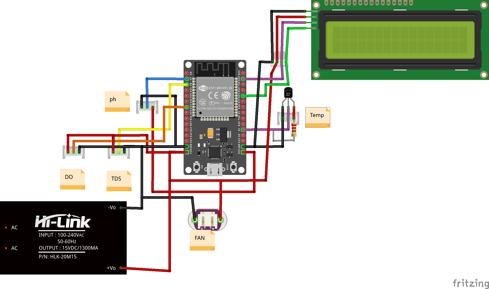

# Monitoring Kolam (pH, TDS, Suhu, dan DO)

## Deskripsi Proyek
Proyek ini merupakan sistem monitoring kualitas air kolam berbasis ESP32 yang dapat mengukur dan memantau parameter penting seperti pH, TDS (Total Dissolved Solids), suhu, dan DO (Dissolved Oxygen) secara real-time. Data hasil pengukuran dikirimkan ke Firebase Realtime Database dan Firestore untuk pemantauan jarak jauh melalui internet.

Sistem ini juga dilengkapi dengan LCD untuk menampilkan data secara lokal dan web server sederhana untuk konfigurasi WiFi dan kredensial Firebase.

## Fitur Utama
- Monitoring pH, TDS, suhu, dan DO secara real-time
- Pengiriman data otomatis ke Firebase Realtime Database dan Firestore
- Tampilan data pada LCD 20x4
- Web server lokal untuk konfigurasi WiFi dan kredensial Firebase
- Penentuan status kualitas air (Normal, Waspada, Bahaya)

## Cara Kerja
1. **Inisialisasi**: ESP32 akan membaca konfigurasi WiFi dan kredensial Firebase dari Preferences. Jika belum diatur, dapat dikonfigurasi melalui web server lokal.
2. **Koneksi WiFi**: ESP32 terhubung ke jaringan WiFi yang telah dikonfigurasi.
3. **Pembacaan Sensor**: Sensor pH, TDS, suhu (DS18B20), dan DO akan dibaca secara periodik.
4. **Pengolahan Data**: Data sensor diolah dan ditampilkan pada LCD.
5. **Pengiriman Data**: Data dikirim ke Firebase Realtime Database setiap 9 detik dan ke Firestore setiap 30 menit.
6. **Status Air**: Sistem menentukan status kualitas air berdasarkan parameter yang terbaca.
7. **Web Server**: Pengguna dapat mengakses web server lokal untuk mengatur ulang WiFi dan kredensial Firebase.

## Hardware yang Dibutuhkan
- ESP32
- Sensor pH
- Sensor TDS
- Sensor Suhu DS18B20
- Sensor DO
- LCD I2C 20x4
- Koneksi WiFi

## Gambar Rangkaian
Berikut adalah gambar rangkaian yang digunakan pada proyek ini:

## Instalasi Library
Sebelum mengupload kode ke ESP32, pastikan Anda telah menginstal library berikut melalui Library Manager Arduino IDE:

- WiFi (bawaan ESP32)
- [Firebase ESP Client (by Mobizt)](https://github.com/mobizt/Firebase-ESP-Client)
- [OneWire (by Paul Stoffregen)](https://github.com/PaulStoffregen/OneWire)
- [DallasTemperature (by Miles Burton)](https://github.com/milesburton/Arduino-Temperature-Control-Library)
- [GravityTDS (by DFRobot)](https://github.com/DFRobot/DFRobot_GravityTDS)
- EEPROM (bawaan ESP32)
- [LiquidCrystal I2C (by Marco Schwartz atau kompatibel)](https://github.com/johnrickman/LiquidCrystal_I2C)
- Preferences (bawaan ESP32)
- WebServer (bawaan ESP32)
- SPIFFS (bawaan ESP32)

Cara instalasi:
1. Buka Arduino IDE
2. Masuk ke menu **Tools > Manage Libraries...**
3. Cari nama library di atas dan klik **Install**
4. Pastikan board ESP32 sudah terinstall di Board Manager

## Instalasi & Penggunaan
1. Clone repositori ini.
2. Ganti placeholder kredensial pada file `.ino` dengan kredensial Anda secara lokal (jangan commit kredensial asli ke repo publik).
3. Upload kode ke ESP32 menggunakan Arduino IDE.
4. Hubungkan perangkat ke sensor dan LCD sesuai skema.
5. Nyalakan ESP32, akses web server lokal (alamat IP ESP32) untuk konfigurasi jika diperlukan.
6. Data akan otomatis terkirim ke Firebase dan dapat dipantau secara online.

## Lisensi
Proyek ini bersifat open source dan dapat digunakan untuk keperluan edukasi dan penelitian.
